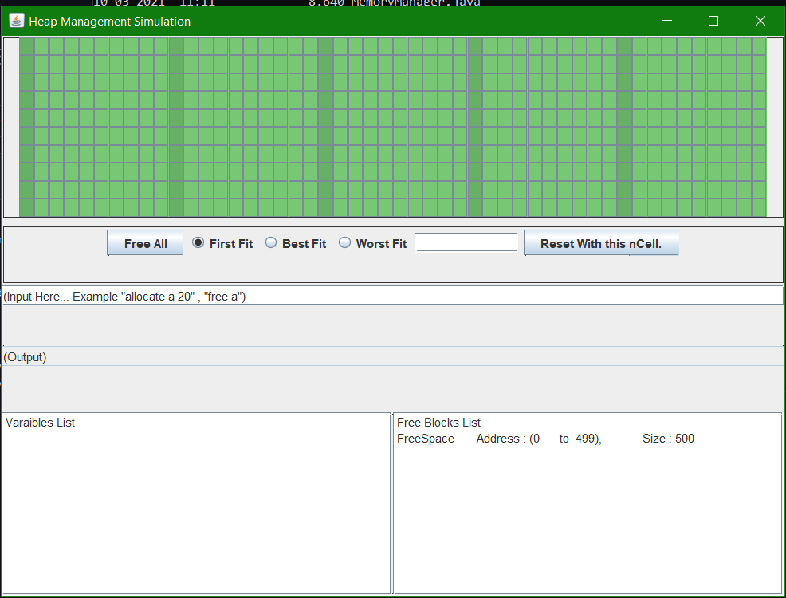
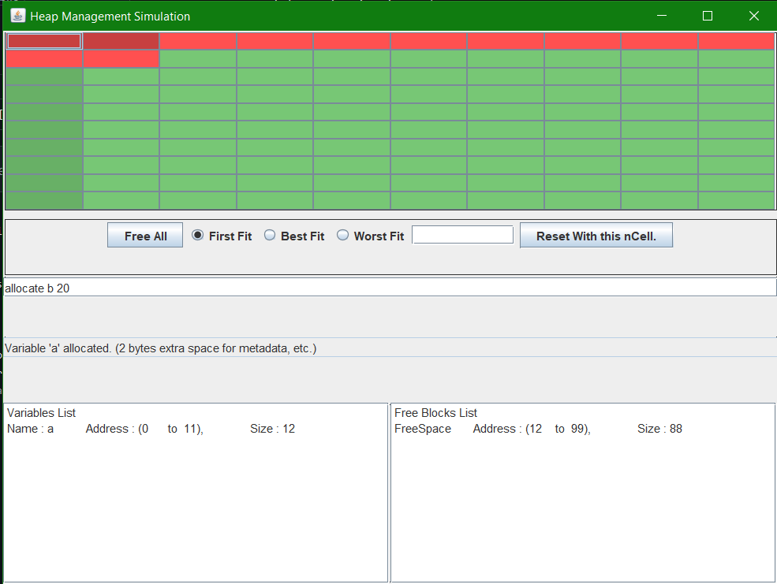
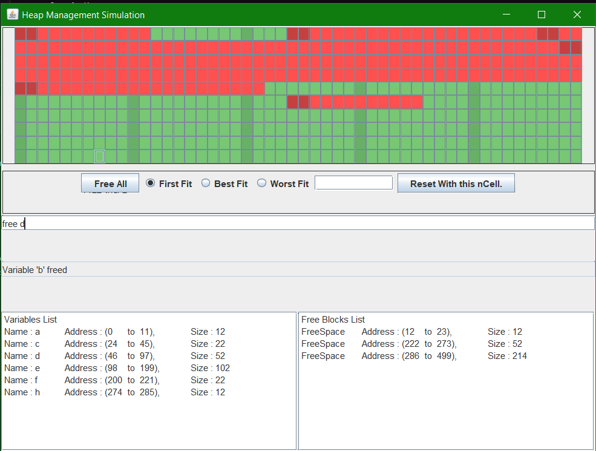

# heap-simulator
A GUI based application demonstrating working of best fit, first fit and worst fit algorithm for dynamic memory allocation. Written in Java, using Swing Framework for GUI.

# Requirement 
Java JDK 15 + installed 

# How to run 

1. Clone the repository by ` git clone https://github.com/nitin12384/heap-simulator `
2. In the src directory of the repository, run `javac StartApp.java` to compile the .class files
3. run ` java StartApp ` to run the application.

# Execution 
- `allocate <var_name> <size>` to allocate memoty
- `free <var_name>` to free the memory allocated to a variable.
- Use `Reset with ncells` to reset the heap with different number of blocks.

# screenshots 

